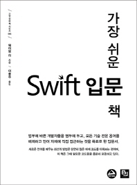

# The-Easiest-Swift-Introduction
***가장 쉬운 Swift 입문 책*** 정리

[교보문고 링크](http://www.kyobobook.co.kr/product/detailViewKor.laf?ejkGb=KOR&mallGb=KOR&barcode=9788994774978&orderClick=LEA&Kc=)

## 장점

- 코드를 짜면서 개선해가는 느낌으로 읽을 수 있다. 예를 들자면, 클래스에는 상속이라는게 있고, 이걸로 추상클래스를 만들수있는데 Swift에는 추상클래스가 없다. 굳이 만들면 이런식으로 만들수있다. 하지만 문제가 생기고, 이때문에 프로토콜을 사용한다는 식? 뭔가 생각의 흐름이 장을 넘어가면서 자연스럽게 이어지는 느낌이었다.

- 어떤 것을 이해하기 위해 필요한 용어가 무엇인지 풀어서 정의해놓았다. 굉장히 편하게 읽힌다.

## 단점

- 사실 굉장히 오래된 책이기에 현재 swift 5가 나온 상황에서 사라진 문법과 기능이 꽤 있다. 위에 장점이라고 적어 놓은 것도 다른 책도 가지고 있을 수 있다.

## 총평

너무 오래되었다. 읽는다면 문법은 다 넘기고, OOP 같은 개념만 챙겨라. 나도 전에 중고로 샀기때문에 책 정리하면서 본거지 지금은 구매해서 안 볼 듯하다.
